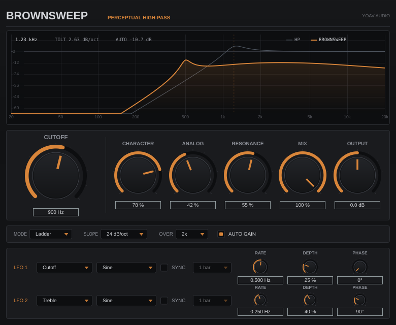

# BrownSweep

**Perceptual High-Pass** — Yoav Audio
VST3 + Standalone, C++17 / JUCE, CMake.

A high-pass filter designed so that automating the cutoff upward sounds like the
sound is *running out of energy*, rather than like its low end is being deleted
while the top gets progressively more exposed.



The dim curve is what a conventional high-pass of the same cutoff, slope and
resonance would do. The bright curve is what BrownSweep is doing. Everything
below is about the gap between them.

---

## 1. The problem this plugin exists to solve

Sweep a conventional 24 dB/octave high-pass across pink noise, from 20 Hz to
2.1 kHz, and measure what actually happened:

| | at 20 Hz cutoff | at 2.1 kHz cutoff | change |
|---|---|---|---|
| K-weighted loudness | 0.0 dB | −2.3 dB | **−2.3 dB** |
| energy above 4 kHz | −3.6 dB | −3.6 dB | **0.0 dB** |
| spectral centroid | 652 Hz | 6619 Hz | **+3.3 octaves** |

You have removed the majority of the spectrum, the sound is unrecognisable, and
the meter has barely moved. The top end is *exactly where it was*, but it is now
the only thing left, so it dominates. That mismatch — enormous timbral change,
negligible loudness change, centroid running away toward Nyquist — is why HP
automation sounds like an effect being applied to a sound instead of a sound
receding.

Doubling down on the filter does not help. A steeper slope makes the low-end
removal more abrupt without touching the top. Turning the cutoff more slowly
just stretches the same problem over more bars.

## 2. The idea

> As the cutoff rises, progressively tilt the *surviving* spectrum downward, and
> put the resulting loudness on a designed contour.

Two mechanisms, both scheduled against the cutoff:

**A tilt anchored to the cutoff.** A downward spectral tilt — brown-noise
weighting is the reference point, −6 dB/octave in amplitude, 1/f² in power — is
applied to everything above the cutoff, and it slides upward with the cutoff.
The octave immediately above the corner (the part that carries the "note" of the
sweep, plus any resonance) is left alone; everything above it is progressively
pulled down. The spectral centre of gravity therefore tracks the cutoff instead
of racing to the top of the band.

**A loudness contour.** The filter's K-weighted loudness on a pink reference is
measured offline across the entire control range, and a scheduled gain puts it
on a smooth, monotonic, near-linear-in-dB ramp: roughly −45 dB from the bottom
of the range to the top, at CHARACTER = 100%.

### What this is not

Brown noise is the *weighting reference*, not the target sound. In particular
this plugin does **not** try to restore low frequencies to match a 1/f² curve
after high-passing. Once the high-pass has removed them, they are gone; boosting
what is left below the corner would just amplify filter skirt and noise. The
brown weighting is applied to the part of the spectrum that still exists —
above the cutoff — which is the only place it can do any good.

## 3. Which DSP approach, and why

Six candidate architectures were considered before settling. All of them were
evaluated against the same criterion: does an upward sweep produce a monotonic
loudness fade with a bounded centroid rise, at a CPU cost you can put on twenty
channels?

| # | Approach | Verdict |
|---|---|---|
| 1 | **HP + dynamic high shelf.** One shelf whose cut deepens with cutoff. | Rejected. A single first-order shelf can only produce ~6 dB/oct over about two octaves before flattening out; a second-order one has a knee you can point at. Fixes the octave above the cutoff and does nothing about the two octaves above *that*. |
| 2 | **HP + dynamic spectral tilt (staggered shelf cascade).** | **Chosen.** N first-order shelves one octave apart, each cutting D dB, give a near-constant −D dB/octave slope over the whole band. Zero latency, minimum phase, continuously modulatable, ~10 one-poles per channel. |
| 3 | **HP + frequency-dependent gain compensation.** A broadband gain scheduled from the cutoff. | Kept, but not sufficient on its own — it is exactly the AUTO contour (§7). A flat gain cannot move the centroid, so it fixes the loudness half of the problem and none of the brightness half. |
| 4 | **Filter bank / multiband.** Split into bands, gain each independently. | Rejected. Crossovers at fixed frequencies fight a moving cutoff, phase relationships between bands smear transients, and the per-band gains have to be re-derived every block anyway. More CPU and more artefacts than #2 for the same curve. |
| 5 | **FFT spectral shaping.** Apply the exact target curve per bin. | Rejected — see below. |
| 6 | **Non-linear analogue filter model** (ladder / Sallen-Key with in-loop saturation). | Kept as a *component*, not as the architecture. In-loop saturation gives the resonance its analogue behaviour (§8), but a ladder model on its own has exactly the conventional high-pass's perceptual problem. |

**Why not FFT.** An FFT tilt would be exact, and if the tilt were static it would
be a reasonable choice. It is not static: the anchor moves with every cutoff
change, which is the entire point of the design. That means rebuilding the
window's gain curve continuously, which reintroduces the smearing that
overlap-add is supposed to avoid; and it costs a window of latency (2048 samples
is ~43 ms at 48 kHz), which makes the plugin unusable for live filter riding.
The shelf cascade reaches the same curve to within 0.7 dB (measured, §6) at zero
latency and about a tenth of the CPU. For a broadband tilt with no sharp
features, a well-designed IIR is simply the better tool.

## 4. Signal chain

```
IN ──┬───────────────────────────────────────────────[ dry delay ]──┐
     │                                                              │
     └─[ up 2x/4x ]─ HP cascade ─ brown tilt ─ tone ─ analogue ─[ down ]─ × AUTO gain ─┤
                                                                                       │
                                                                    MIX ───────────────┴─── × OUTPUT ── OUT
```

Every coefficient is recomputed once per ~0.35 ms control block and **shared by
all channels**. Per-channel state, shared coefficients: that is what guarantees
the stereo image survives.

The tone stage (a low shelf at 180 Hz, a wide bell at 900 Hz, a high shelf at
3.2 kHz) is flat by default and exists only as LFO destinations. At 0 dB each
section is a bit-exact bypass.

## 5. The high-pass stage

A cascade of Butterworth-aligned TPT (zero-delay-feedback) state-variable
sections, 12 / 18 / 24 / 36 / 48 dB per octave.

**Why TPT and not biquads.** Cutoff is the main automation target, so
coefficients change on every control block. Direct-form biquads misbehave under
fast coefficient modulation — the state no longer means what the new
coefficients think it means — which is precisely the "digital zipper" this
plugin is trying to avoid. TPT structures keep their state in physically
meaningful integrator variables and stay well conditioned at 20 Hz / 192 kHz.
They are also exactly the bilinear transform of their analogue prototype, which
makes the response model in §6 *exact* rather than approximate.

**Slope morphing without clicks.** All four SVF sections always run. Sections the
current slope does not need are cross-faded to an algebraic bypass rather than
switched off, and their Q targets are smoothed, so changing SLOPE mid-performance
cannot click and CPU cost is independent of slope.

**Resonance** multiplies the Q of the *last* active section only, up to a peak
about 12 dB above the Butterworth response. Deliberately modest: self-oscillation
would fight the perceptual-balance concept. Placing it last means the
level-dependent damping (§8) sees an already high-passed signal, so the resonance
blooms and settles the way a real cascaded analogue filter does.

## 6. The brown-noise-inspired tilt

Ten first-order high-shelf sections, corner frequencies staggered one octave
apart starting one octave above the cutoff, each cutting the same D dB. N shelves
spaced an octave apart each dropping D dB sum to a near-constant **−D dB/octave**
slope — a cheap, stable, minimum-phase approximation of a fractional-order
1/f^(D/6) filter. At D = 6 the amplitude slope is exactly the brown-noise
weighting.

Measured (`brownsweep_analysis --tilt`, and asserted in the test suite):

| requested dB/oct | measured slope, 2–8 oct | ripple, peak-to-peak | −1 dB point | −3 dB point |
|---|---|---|---|---|
| 1.0 | −0.99 | 0.06 dB | 1.39 oct above fc | 3.58 oct |
| 2.0 | −1.98 | 0.14 dB | 0.70 oct | 2.08 oct |
| 3.0 | −2.96 | 0.24 dB | 0.40 oct | 1.56 oct |
| 4.5 | −4.44 | 0.43 dB | 0.16 oct | 1.19 oct |
| 6.0 | −5.90 | 0.70 dB | 0.03 oct | 1.00 oct |

Two properties matter here. The slope is accurate to better than 2%, and the
tilt is essentially flat *at and below the cutoff* — at 3 dB/octave it has not
reached −1 dB until 0.4 octaves above the corner. That is the anchoring working:
the cutoff region survives, the spectrum above it does not.

Sections whose corner approaches Nyquist are faded to a shelf gain of exactly
1.0, which makes them a bit-exact bypass, so they can never click and never park
energy at Nyquist.

## 7. Cutoff → tilt, and cutoff → loudness

Everything is scheduled against `u`, the **normalised cutoff position**:

```
u = log2(fc / 20 Hz) / log2(20 kHz / 20 Hz)
```

A control that is linear in log frequency is the only kind that can be
perceptually linear, which is the whole basis of the design.

**Tilt schedule.** `tilt(u) = 6 dB/oct × CHARACTER × smoothstep((u − 0.12) / 0.88)`.
Zero below about 60 Hz (so low cutoff settings stay uncoloured), gentle through
the low mids, strongest at the top:

| cutoff | 20 Hz | 134 Hz | 532 Hz | 1.06 kHz | 4.2 kHz | 20 kHz |
|---|---|---|---|---|---|---|
| tilt at CHARACTER 100% | 0.00 | 0.49 | 2.14 | 3.15 | 5.02 | 6.00 dB/oct |

**Loudness contour (AUTO).** The target is

```
target(u, c) = −45 dB × CHARACTER × s(u),   s(w) = 1.15 · w² / (w + 0.15),  w = (u − 0.05)/0.95
```

`s` has zero slope at the origin (so the fade does not "switch on" as you leave
the bottom of the range) and is asymptotically linear (so the fade rate is
steady). A power law — `w^1.15` was the first thing tried — has a near-infinite
second derivative at the origin and audibly snaps in.

The measured side comes from `LoudnessSchedule`, which integrates the *real*
response of the chain against a pink reference spectrum and an analogue
approximation of the ITU-R BS.1770 K-weighting curve, over a grid of
(cutoff × character × resonance × slope). Then:

```
gain = −smoothHinge(measured − target)
```

`smoothHinge` is C1 (no kink where the natural response crosses the target) and
is exactly zero for negative arguments, so **AUTO is never a boost**. Two
consequences worth stating plainly:

* At CHARACTER = 0 the target is 0 dB and the measured response is always ≤ 0 dB,
  so the gain is exactly unity. "0% = an ordinary high-pass" is literally true,
  not approximately true.
* At the extreme top of the range AUTO cannot lift the residue, so it can never
  amplify hiss into the last two octaves.

The table is built once (about 60 ms), in the analogue domain, so it is
sample-rate independent and costs nothing at `prepareToPlay` time. It is
interpolated with Catmull-Rom along the cutoff axis — plain linear interpolation
leaves a slope discontinuity at every table node, which during a slow sweep is
audible as the fade rate changing gear.

## 8. Analogue colouring

Three things, none of which is allowed to sound like distortion.

**Asymmetric soft saturation.**

```
y = norm · (tanh(d·x + b) − tanh(b)) / d,    d = 1.8 · ANALOG,  b = 0.14 · ANALOG
```

This degenerates to `y = x` *exactly* as `d → 0`, so ANALOG = 0% is a true
bypass rather than "a little bit of tanh". The bias `b` generates the second
harmonic that makes the stage read as valve-ish rather than fuzzy; dividing by
`d` and normalising by `1 − tanh²b` holds the small-signal gain at unity, so the
stage only does something when the signal is actually loud. Measured THD at
ANALOG = 100% with a −6 dBFS 1 kHz sine: **2–4%**, with a real second-harmonic
component. The test suite fails the build if it drops below 0.5% (doing nothing)
or rises above 10% (too dirty).

**Level-dependent filter damping.** The resonant SVF section's damping term `k`
is increased in proportion to the squared band-pass state. Real resonant filters
lose Q as the resonant path is driven hard — it is why a hardware ladder blooms
and then settles instead of ringing at a constant amplitude. Because the term can
only ever *increase* damping, it is unconditionally stable.

**Controlled high-frequency attenuation.** A first-order high shelf removing up
to 4.5 dB above 9 kHz, scaled by ANALOG. This is what stops the residue at high
cutoff settings from sounding clinical, and it suppresses whatever aliasing
survives the oversampler. At ANALOG = 0 its gain is exactly 1.0.

A 12 Hz DC blocker follows, because the asymmetry deliberately introduces an
offset.

## 9. Oversampling and latency

Hand-rolled 2x / 4x polyphase half-band FIR (Kaiser-windowed, designed at run
time). The **entire wet chain** is oversampled, not just the waveshaper: the
filters also behave better near Nyquist at high cutoff settings, and it keeps the
inner loop simple.

| setting | latency | measured image rejection |
|---|---|---|
| Off | 0 samples | — |
| 2x (default) | 23 samples (0.48 ms @ 48 kHz) | > 80 dB |
| 4x | 30.5 samples (0.64 ms @ 48 kHz) | > 80 dB |

Cost is roughly 12 multiplies per sample per channel per stage. The dry path is
delayed by the exact latency — *including the half sample at 4x* — with a
3rd-order Lagrange fractional delay, so intermediate MIX settings never comb.
Changing the oversampling setting fades out over 8 ms, reconfigures, and fades
back in, so it cannot click; it does not allocate.

## 10. Measured behaviour

Pink noise, CHARACTER 100%, RESONANCE 0%, 24 dB/octave. `BS` is BrownSweep, `HP`
is a conventional high-pass at the same cutoff and slope. `>4k` is the *absolute*
K-weighted level of everything above 4 kHz, relative to the unfiltered source —
the number that explains the perceptual difference. Reproduce with
`brownsweep_analysis`.

| cutoff | tilt | BS loudness | BS centroid | BS >4k | HP loudness | HP centroid | HP >4k |
|---|---|---|---|---|---|---|---|
| 20 Hz | 0.00 | −0.02 dB | 699 Hz | −3.6 | −0.01 dB | 652 Hz | −3.6 |
| 34 Hz | 0.00 | −0.05 | 864 | −3.6 | −0.03 | 839 | −3.6 |
| 67 Hz | 0.07 | −1.21 | 1126 | −4.8 | −0.16 | 1185 | −3.6 |
| 134 Hz | 0.49 | −5.00 | 1214 | −9.1 | −0.40 | 1673 | −3.6 |
| 267 Hz | 1.22 | −9.80 | 1356 | −14.5 | −0.73 | 2361 | −3.6 |
| 532 Hz | 2.14 | −14.83 | 1779 | −19.9 | −1.11 | 3331 | −3.6 |
| 1.06 kHz | 3.15 | −19.98 | 2705 | −24.5 | −1.57 | 4698 | −3.6 |
| 2.12 kHz | 4.15 | −25.22 | 4485 | −27.9 | −2.31 | 6619 | −3.6 |
| 4.23 kHz | 5.02 | −30.50 | 7592 | −30.8 | −3.72 | 9305 | −3.9 |
| 8.43 kHz | 5.67 | −35.84 | 12182 | −35.8 | −6.13 | 12988 | −6.1 |
| 16.8 kHz | 5.99 | −41.31 | 17149 | −41.3 | −11.83 | 17317 | −11.8 |

Read the `>4k` columns first. The conventional high-pass holds the energy above
4 kHz at −3.6 dB from a 20 Hz cutoff all the way to a 3.5 kHz cutoff — it is
*physically impossible* for that sweep to sound like anything but "the bottom is
being taken away and the top is being revealed". BrownSweep pulls the same band
down monotonically, 21 dB by the time the cutoff reaches 1 kHz.

Then read the loudness column. dLoudness/du settles at −50 to −55 dB per unit of
control travel and stays there — the fade is steady, with no plateau and no
cliff. The conventional filter manages −1.6 dB by 1 kHz and then falls off the
edge in the last two octaves.

The centroid is held about 0.9 octaves lower through the middle of the range. It
cannot be held down at the extremes: at the bottom nothing has been removed yet,
and at the top only a narrow band survives, so both filters must put their
centroid in the same place. In the middle — where sweeps live — the difference is
substantial and is asserted by the test suite.

The same behaviour holds on brown noise, white noise, and a synthetic
saw-with-rolloff "psytrance lead". Total K-weighted loudness change across a
full 20 Hz → 20 kHz sweep, same 24 dB/oct slope, no resonance:

| source | conventional HP | BrownSweep |
|---|---|---|
| pink | −15.1 dB | −42.7 dB |
| brown | −30.9 dB | −58.4 dB |
| white | −9.7 dB | −37.4 dB |
| lead (saw @ 110 Hz) | −36.6 dB | −64.2 dB |

White noise with resonance is the pathological case. Take a conventional
48 dB/oct high-pass with RESONANCE at 100% and sweep it across white noise: at a
3.6 kHz cutoff it is **+0.4 dB louder than it was at 20 Hz**, at 16.8 kHz it is
still +0.3 dB up, and even at the very top of the range it has only lost 1.2 dB.
The resonant peak gains back more than the removed low end cost. There is no
automation curve you can draw over that which sounds like a fade. BrownSweep on
the same source and settings falls monotonically to −37.0 dB.

## 10a. CPU

Measured with `Tools/`-style timing on a 4-core cloud VM (a deliberately modest
machine — a desktop CPU is considerably faster), one stereo instance at 48 kHz
with both LFOs running, expressed as a percentage of one core:

| oversampling | 12 dB/oct | 24 dB/oct | 48 dB/oct |
|---|---|---|---|
| Off | 1.6% | 1.6% | 1.5% |
| 2x (default) | 3.0% | 2.9% | 2.7% |
| 4x | 5.9% | 6.2% | 5.5% |

Two things worth noticing. Cost is **flat across slope settings** — all four
filter sections always run, with the unused ones cross-faded to a bypass, which
is what makes SLOPE changes click-free and makes CPU predictable when you have
twenty instances open. And there is no FFT anywhere, so there is no block-size
sensitivity and no latency beyond the oversampler's.

## 11. Controls

| control | range | default | notes |
|---|---|---|---|
| **CUTOFF** | 20 Hz – 20 kHz, logarithmic | 20 Hz | The performance control. Everything else is scheduled against it. |
| **CHARACTER** | 0 – 100% | 65% | How strongly the perceptual balancing acts. 0% is an ordinary high-pass, bit-for-bit. |
| **ANALOG** | 0 – 100% | 30% | Saturation, in-filter damping, top-end softening. 0% is a true bypass. |
| **RESONANCE** | 0 – 100% | 0% | Up to about +12 dB at the corner. Interacts with ANALOG. |
| **MIX** | 0 – 100% | 100% | Latency-compensated. |
| **OUTPUT** | −24 – +24 dB | 0 dB | Final trim, after the mix. |
| **SLOPE** | 12/18/24/36/48 dB/oct | 24 | Morphs without clicking. The concept works identically at every setting. |
| **AUTO GAIN** | on/off | on | The loudness contour of §7. Off = the raw filter, for A/B and for your own gain staging. |
| **OVERSAMPLING** | Off / 2x / 4x | 2x | Not automatable — it changes the reported latency. |

All of CUTOFF, CHARACTER, ANALOG, RESONANCE, MIX, OUTPUT, SLOPE and AUTO GAIN,
plus every LFO parameter, are exposed as automatable VST3 parameters and are
smoothed. Cutoff is smoothed in log₂(Hz) over 60 ms, so even a coarsely stepped
host automation curve arrives as a continuous glide.

### CHARACTER, practically

* **0%** — an ordinary high-pass. Use it for gain-staging cleanup, or to hear
  what the plugin is actually doing by comparison.
* **30–50%** — corrective. Sweeps still read as filter sweeps but stop getting
  brighter as they rise.
* **65% (default)** — the intended sound: sweeps read as the source receding.
* **100%** — full brown weighting. Large cutoff moves become large energy moves;
  best for slow build-ups where the filter *is* the arrangement.

## 12. LFOs

Two identical modulators.

* **Destination** — Off, Cutoff (±2 oct), Resonance, Character, Saturation,
  Treble (±10 dB), Mid Level (±10 dB), Bass Level (±12 dB), Amplitude
  (0 to −36 dB, downward only, so it can never make the plugin louder), Mix.
* **Shape** — Sine, Triangle, Saw Up, Saw Down, Square (soft-edged, so it cannot
  click a filter coefficient), Sample & Hold, Smooth Random.
* **Rate** — 0.01 – 20 Hz, or tempo-synced from 8 bars down to 1/32 including
  dotted and triplet divisions.
* **Depth**, **Phase**.

Both LFOs are **mono**: left and right receive identical modulation. That is a
deliberate restriction — independent per-channel modulation is the fastest way to
destroy the stereo relationship of a pad or a supersaw.

Treble / Mid Level / Bass Level drive a tone stage that is flat and bit-exactly
transparent when not modulated.

## 13. The display

Two curves, both computed from `ResponseModel`:

* dim — what a **conventional** high-pass of the same cutoff, slope and resonance
  would do;
* bright — what **BrownSweep** is doing right now, including the AUTO gain, the
  tone stage, the analogue shelf and the dry/wet mix.

Because every filter in the plugin is a TPT structure derived by bilinear
transform with prewarping, the model is not an illustration of the DSP — it *is*
the DSP's transfer function. The test suite verifies this by FFT-ing the engine's
measured impulse response and comparing: agreement is better than 0.6 dB
everywhere above −80 dB.

## 14. Building

Requirements: CMake ≥ 3.22 and a C++17 compiler. JUCE is downloaded
automatically unless you point at a local checkout.

```bash
cmake -S . -B build -DCMAKE_BUILD_TYPE=Release
cmake --build build --parallel
```

Using an existing JUCE:

```bash
cmake -S . -B build -DCMAKE_BUILD_TYPE=Release -DBROWNSWEEP_JUCE_PATH=/path/to/JUCE
```

DSP and tests only, with no JUCE download at all:

```bash
cmake -S . -B build -DBROWNSWEEP_BUILD_PLUGIN=OFF
cmake --build build --parallel
```

| CMake option | default | effect |
|---|---|---|
| `BROWNSWEEP_BUILD_PLUGIN` | ON | VST3 + Standalone (needs JUCE) |
| `BROWNSWEEP_BUILD_TESTS` | ON | the test suite (no JUCE) |
| `BROWNSWEEP_BUILD_TOOLS` | ON | `brownsweep_analysis` (no JUCE) |
| `BROWNSWEEP_BUILD_GUI_SNAPSHOT` | OFF | `brownsweep_snapshot`, renders the editor to a PNG without opening a window |
| `BROWNSWEEP_COPY_AFTER_BUILD` | OFF | install into the user plug-in folders on every build |
| `BROWNSWEEP_JUCE_PATH` | *(empty)* | use a local JUCE checkout instead of downloading one |
| `BROWNSWEEP_JUCE_TAG` | `8.0.6` | which JUCE tag to fetch |

Linux additionally needs the usual JUCE development packages:

```bash
sudo apt install libasound2-dev libx11-dev libxcomposite-dev libxcursor-dev \
                 libxext-dev libxinerama-dev libxrandr-dev libxrender-dev \
                 libfreetype-dev libfontconfig1-dev libglu1-mesa-dev
```

### Installing the VST3

The build produces `build/BrownSweep_artefacts/Release/VST3/BrownSweep.vst3` and
a standalone application beside it.

| platform | destination |
|---|---|
| Linux | `~/.vst3/` (or `/usr/lib/vst3/`) |
| macOS | `~/Library/Audio/Plug-Ins/VST3/` |
| Windows | `C:\Program Files\Common Files\VST3\` |

```bash
# Linux
mkdir -p ~/.vst3 && cp -r build/BrownSweep_artefacts/Release/VST3/BrownSweep.vst3 ~/.vst3/
```

```bash
# macOS
cp -R build/BrownSweep_artefacts/Release/VST3/BrownSweep.vst3 ~/Library/Audio/Plug-Ins/VST3/
```

Add `-DBROWNSWEEP_COPY_AFTER_BUILD=TRUE` to install automatically on every build.

## 15. Testing

```bash
cd build && ctest --output-on-failure
# or run the binary directly, optionally filtered by substring:
./build/Tests/brownsweep_tests
./build/Tests/brownsweep_tests Perceptual
```

50 tests, ~163,000 assertions. Coverage:

*Well-formedness* — no NaNs or infinities on silence, impulses, DC, white/pink/
brown noise and sines from 20 Hz to 18 kHz; stability at every cutoff and slope
extreme, at 0% and 100% resonance, at 44.1 / 48 / 88.2 / 96 / 192 kHz, over
five minutes of continuous audio with both LFOs at full depth; DC removal; the
internal "a non-finite sample appeared" counter is asserted to stay at zero.

*Channels* — mono works; identical stereo input produces bit-identical output
(any drift would mean the channels are not sharing coefficients); no crosstalk;
left and right have identical transfer functions; buses from 1 to 8 channels.

*Smoothing* — slamming every control from one extreme to the other mid-signal
never produces an output step larger than the input itself can produce; the same
for SLOPE changes and for OVERSAMPLING changes.

*Correctness* — the analytic response model matches an FFT of the engine's
measured impulse response; the fully dry path, and the bypassed path, are the
input delayed by exactly the reported latency; the oversampler's round trip is unity and its image rejection
exceeds 80 dB; the tilt cascade hits its requested slope; the saturator is
monotonic, bounded, exactly transparent at 0% and exactly zero at zero input.

*Perceptual* — **rising cutoff never increases the energy above 4 kHz**, at every
slope and every CHARACTER setting; loudness falls monotonically with no step
larger than 2 dB per 0.5% of control travel and reaches below −38 dB at the top;
the response never gains anywhere beyond the documented resonance allowance; the
spectral centroid never exceeds a conventional high-pass's and is at least half
an octave below it through the middle of the range; CHARACTER = 0 reproduces a
plain high-pass to within 0.05 dB.

The editor can be rendered to a PNG without opening a window, which is how the
screenshot above is produced:

```bash
cmake -S . -B build -DBROWNSWEEP_BUILD_GUI_SNAPSHOT=ON && cmake --build build
./build/brownsweep_snapshot_artefacts/Release/brownsweep_snapshot Docs/screenshot.png 900 78 34
```

`brownsweep_analysis` is the measurement rig the design constants were tuned
against:

```bash
./build/brownsweep_analysis                     # all sources, human-readable
./build/brownsweep_analysis --tilt              # tilt cascade accuracy
./build/brownsweep_analysis --csv --source lead --character 1.0 --slope 4
```

## 16. Limitations and compromises

**The loudness schedule assumes a pink-ish source.** The contour is derived by
integrating the filter's response against a pink reference. On material that is
much brighter than pink, the fade will be a few dB shallower than designed
(white noise reaches −35.8 dB at the top of the sweep where pink reaches −42.7).
Making it source-adaptive would require a level detector in the gain path — that
is a compressor, it would pump under automation, and it would make the plugin's
behaviour depend on what came before it. A fixed, documented, predictable
schedule is the better trade for an automation target.

**The centroid still rises.** It has to: the low end really is gone. What the
tilt buys is that it rises *with the cutoff* rather than jumping to the top of the
spectrum, and that the level falls at the same time. At the extreme top of the
range, where only a narrow band survives, BrownSweep and a conventional filter
necessarily put their centroid in the same place — the difference by then is that
one of them is 30 dB quieter.

**AUTO GAIN changes level with CHARACTER.** That is by design: CHARACTER controls
how much perceptual balancing happens, and the energy fade is part of the
balancing. It is not a "make character free" control. If you want to compare
timbres at matched loudness, use OUTPUT.

**Tilt ripple.** 0.70 dB peak-to-peak at the maximum 6 dB/octave, 0.24 dB at
3 dB/octave. Adding a second shelf per octave does not help — the residual is
end-of-cascade curvature, not inter-section ripple — and it is well below
audibility for a broadband tilt.

**Oversampling is not free.** The whole wet chain runs at the oversampled rate,
so 4x costs roughly four times the filter work of Off. 2x is the default because
it is the right trade when ANALOG is in use; if you are running twenty instances
with ANALOG at 0%, Off is genuinely transparent and costs nothing.

**Latency is not zero unless oversampling is Off.** 23 or 30.5 samples, reported
to the host, and the dry path is compensated internally. Rounding to an integer
for the host means the 4x setting is half a sample out relative to other tracks —
inaudible, and unavoidable without adding latency to the 2x case too.

**Single precision.** The engine is float throughout. Double-precision hosts are
served through a conversion buffer. A filter this simple gains nothing measurable
from doubles, and float keeps the oversampled inner loop cache-friendly.

**No AU / AAX build.** The CMake target builds VST3 and Standalone. Adding `AU`
to `FORMATS` works on macOS with no code changes; AAX needs the (NDA'd) SDK.

## 17. File map

```
Source/dsp/                 the complete signal chain, no JUCE dependency
  DesignConstants.h         every tuned number, with its justification
  DspMath.h                 helpers, smoothing, the smooth hinge
  Filters.h                 TPT one-pole and state-variable structures
  HighPassStage.h           Butterworth cascade, slope morphing, resonance
  BrownTilt.h               the staggered shelf cascade
  ToneStage.h               bass / mid / treble trims (LFO destinations)
  AnalogStage.h             saturation, asymmetry, HF softening
  Oversampler.h/.cpp        polyphase half-band 2x / 4x
  FractionalDelay.h         Lagrange delay for the dry path
  Lfo.h                     two modulators, free or tempo-synced
  ResponseModel.h/.cpp      exact analytic response of the linear chain
  LoudnessSchedule.h/.cpp   the AUTO contour and its offline measurement
  BrownSweepEngine.h/.cpp   the engine that ties it together

Source/                     JUCE plugin wrapper
  Parameters.h/.cpp         parameter layout and the bridge to the engine
  PluginProcessor.h/.cpp
  PluginEditor.h/.cpp
  gui/                      theme, look and feel, response display

Tests/                      50 tests, no external dependencies
Tools/SweepAnalysis.cpp     the measurement rig
Tools/GuiSnapshot.cpp       headless editor screenshot
```

## 18. Licence

The BrownSweep source in this repository is MIT licensed (see `LICENSE`).

JUCE itself is **not** MIT licensed. It is dual-licensed: the AGPLv3 for open
source work, or a commercial licence from [juce.com](https://juce.com). Building
and distributing a binary of this plugin means complying with one of those. The
`Source/dsp` tree contains no JUCE code and is MIT licensed unconditionally.
